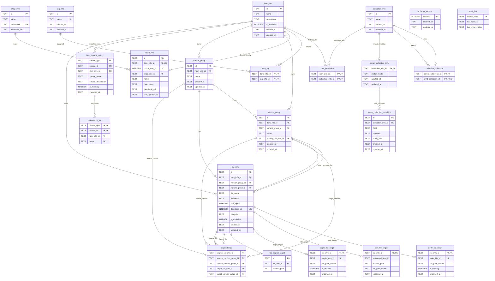

# AssetManager DB Schema

AssetManager 独自 DB の schema です。Item / File / Collection を中心に、Booth・Eagle・ee4v の origin を分離して保持します。

関連する datasource の元データは [Datasource Data Elements](./data-elements.md) を参照してください。

## Enum

```sql
CHECK (source_type IN ('blm', 'eagle', 'ee4v'))
CHECK (last_sync_status IN ('success', 'failed', 'partial'))
CHECK (file_lifecycle IN ('active', 'archived'))
CHECK (smart_collection_match_mode IN ('all', 'any'))
CHECK (smart_collection_condition_field IN ('name', 'description', 'tag', 'source_type', 'file_name', 'extension', 'lifecycle'))
CHECK (smart_collection_condition_operator IN ('contains', 'equals', 'in', 'exists'))
```

## Relation Diagram



## Item Info

AssetManager 上の表示単位。Booth 商品、Eagle item、手動登録 file などを統合して扱う。

Booth 由来 item の初回作成時は `booth_info.name` / `booth_info.description` で初期化し、`item_info.name` / `item_info.description`は上書きを許可する。

| column | type | required | unique | note |
|---|---|---:|---|---|
| `id` | GUID string | Yes |  | Item Info の識別子 |
| `name` | TEXT | Yes |  | 表示名。ユーザー上書き可能 |
| `description` | TEXT | Yes |  | 表示用説明。ユーザー上書き可能。空文字を許容 |
| `is_available` | BOOLEAN | Yes |  | datasource item が現在の snapshot に存在するか。手動 item は常に available |
| `created_at` | DATETIME | Yes |  | 作成時刻 |
| `updated_at` | DATETIME | Yes |  | 更新時刻 |

## Tag Info

AssetManager 独自 tag の正本。Booth tag / Eagle tag とは完全に独立して扱う。

Datasource tag はこの table へ混ぜず、後述の `datasource_tag` に snapshot として保存する。

| column | type | required | unique | note |
|---|---|---:|---|---|
| `id` | GUID string | Yes |  | Tag Info の識別子 |
| `name` | TEXT | Yes | Yes | tag 名 |
| `created_at` | DATETIME | Yes |  | 作成時刻 |
| `updated_at` | DATETIME | Yes |  | 更新時刻 |

```sql
name TEXT NOT NULL UNIQUE
```

## Item Tag

Item と AssetManager 独自 tag の付与関係。

| column | type | required | unique | note |
|---|---|---:|---|---|
| `item_info_id` | GUID string | Yes | `(item_info_id, tag_info_id)` | 親 Item Info |
| `tag_info_id` | GUID string | Yes | `(item_info_id, tag_info_id)` | 付与 Tag Info |

```sql
CREATE UNIQUE INDEX unique_item_tag
ON item_tag(item_info_id, tag_info_id);
```

## Collection Info

AssetManager 独自 folder / collection。階層構造は `collection_collection` で管理し、Item は複数 Collection に所属できる。

| column | type | required | unique | note |
|---|---|---:|---|---|
| `id` | GUID string | Yes |  | Collection Info の識別子 |
| `name` | TEXT | Yes |  | collection 名 |
| `created_at` | DATETIME | Yes |  | 作成時刻 |
| `updated_at` | DATETIME | Yes |  | 更新時刻 |

## Smart Collection Info

条件に一致する Item を自動収集する Collection。

通常 Collection と同じ `collection_info` として階層に配置し、条件定義だけを Smart Collection 固有情報として保持する。

Smart Collection の所属 Item は永続化しない。条件評価による Item 抽出は `smart_collection_condition` から実行する。

| column | type | required | unique | note |
|---|---|---:|---|---|
| `collection_info_id` | GUID string | Yes | Yes | 対応する Collection Info |
| `match_mode` | smart_collection_match_mode | Yes |  | 複数条件の結合方法 |
| `created_at` | DATETIME | Yes |  | 作成時刻 |
| `updated_at` | DATETIME | Yes |  | 更新時刻 |

```sql
CHECK (match_mode IN ('all', 'any'))
```

## Smart Collection Condition

Smart Collection の検索条件。

`collection_info_id` が示す Smart Collection に対して、`field` / `operator` / `query_text` の条件定義を表す。

| column | type | required | unique | note |
|---|---|---:|---|---|
| `id` | GUID string | Yes |  | Smart Collection Condition の識別子 |
| `collection_info_id` | GUID string | Yes |  | 親 Smart Collection Info |
| `field` | smart_collection_condition_field | Yes |  | 評価対象 field |
| `operator` | smart_collection_condition_operator | Yes |  | 評価方法 |
| `query_text` | TEXT |  |  | 検索文字列。`exists` では NULL を許容 |
| `created_at` | DATETIME | Yes |  | 作成時刻 |
| `updated_at` | DATETIME | Yes |  | 更新時刻 |

```sql
CHECK (field IN ('name', 'description', 'tag', 'source_type', 'file_name', 'extension', 'lifecycle'))
CHECK (operator IN ('contains', 'equals', 'in', 'exists'))
CHECK (operator = 'exists' OR query_text IS NOT NULL)
```

## Collection Collection

Collection 同士の親子関係。`parent_collection_id` が `child_collection_id` を含む。tree として扱い、子 Collection は最大 1 つの親 Collection だけを持てる。親を持たない Collection は root collection として扱う。

| column | type | required | unique | note |
|---|---|---:|---|---|
| `parent_collection_id` | GUID string | Yes | `(parent_collection_id, child_collection_id)` | 親 Collection Info |
| `child_collection_id` | GUID string | Yes | `(parent_collection_id, child_collection_id)`, `child_collection_id` | 子 Collection Info |

```sql
CHECK (parent_collection_id != child_collection_id)

CREATE UNIQUE INDEX unique_collection_collection
ON collection_collection(parent_collection_id, child_collection_id);

CREATE UNIQUE INDEX unique_collection_collection_child
ON collection_collection(child_collection_id);

CREATE TRIGGER prevent_collection_collection_cycle_insert
BEFORE INSERT ON collection_collection
BEGIN
  SELECT RAISE(ABORT, 'collection cycle is not allowed')
  WHERE NEW.parent_collection_id = NEW.child_collection_id
     OR EXISTS (
       WITH RECURSIVE descendants(id) AS (
         SELECT child_collection_id
         FROM collection_collection
         WHERE parent_collection_id = NEW.child_collection_id

         UNION

         SELECT cc.child_collection_id
         FROM collection_collection cc
         INNER JOIN descendants d
           ON cc.parent_collection_id = d.id
       )
       SELECT 1
       FROM descendants
       WHERE id = NEW.parent_collection_id
     );
END;

CREATE TRIGGER prevent_collection_collection_cycle_update
BEFORE UPDATE OF parent_collection_id, child_collection_id ON collection_collection
BEGIN
  SELECT RAISE(ABORT, 'collection cycle is not allowed')
  WHERE NEW.parent_collection_id = NEW.child_collection_id
     OR EXISTS (
       WITH RECURSIVE descendants(id) AS (
         SELECT child_collection_id
         FROM collection_collection
         WHERE parent_collection_id = NEW.child_collection_id
           AND NOT (
             parent_collection_id = OLD.parent_collection_id
             AND child_collection_id = OLD.child_collection_id
           )

         UNION

         SELECT cc.child_collection_id
         FROM collection_collection cc
         INNER JOIN descendants d
           ON cc.parent_collection_id = d.id
       )
       SELECT 1
       FROM descendants
       WHERE id = NEW.parent_collection_id
     );
END;
```

## Item Collection

Item と Collection の所属関係。

| column | type | required | unique | note |
|---|---|---:|---|---|
| `item_info_id` | GUID string | Yes | `(item_info_id, collection_info_id)` | 親 Item Info |
| `collection_info_id` | GUID string | Yes | `(item_info_id, collection_info_id)` | 所属 Collection Info |

```sql
CREATE UNIQUE INDEX unique_item_collection
ON item_collection(item_info_id, collection_info_id);
```

## Schema Version

AssetManager DB の schema version。現在は `2`。開発段階のため migration は提供せず、version 不一致時は既存 DB を削除して再作成する。

| column | type | required | unique | note |
|---|---|---:|---|---|
| `version` | INTEGER | Yes | Yes | schema version |
| `created_at` | DATETIME | Yes |  | 作成時刻 |
| `updated_at` | DATETIME | Yes |  | 更新時刻 |

```sql
CHECK (version >= 1)
```

## Sync Info

Datasource 別 sync 状態。

| column | type | required | unique | note |
|---|---|---:|---|---|
| `source_type` | source_type | Yes | Yes | sync 対象 datasource |
| `last_sync_at` | DATETIME |  |  | 最後に sync した時刻。未 sync の場合は NULL |
| `last_sync_status` | sync_status | Yes |  | 最後の sync 結果。`success` / `failed` / `partial` |

```sql
CHECK (source_type IN ('blm', 'eagle', 'ee4v'))
CHECK (last_sync_status IN ('success', 'failed', 'partial'))
```

## Booth Info

Booth 商品単位の identity。

`name` / `description` は Booth 由来 snapshot として固定保持し、表示には使わない。

conflict は確認後上書きで対応。

| column | type | required | unique | note |
|---|---|---:|---|---|
| `id` | GUID string | Yes |  | Booth Info の識別子 |
| `item_info_id` | GUID string | Yes | Yes | 親 Item Info |
| `booth_item_id` | INTEGER | Yes | Yes | Booth item ID。BLM `booth_items.id` / Eagle `boothItemId` |
| `shop_info_id` | GUID string | Yes |  | Shop Info への参照 |
| `name` | TEXT | Yes |  | Booth 商品名 |
| `description` | TEXT | Yes |  | Booth 商品説明。取得元に説明がない場合は空文字を保持 |
| `thumbnail_url` | TEXT |  |  | 商品 thumbnail URL |
| `last_updated_at` | DATETIME |  |  | Booth 正本から最後に更新した時刻 |

## Shop Info

Booth shop 単位の情報。複数 Booth Info から共有する。

| column | type | required | unique | note |
|---|---|---:|---|---|
| `id` | GUID string | Yes |  | Shop Info の識別子 |
| `name` | TEXT | Yes |  | ショップ名 |
| `subdomain` | TEXT | Yes | Yes | Booth shop subdomain |
| `thumbnail_url` | TEXT |  |  | shop thumbnail URL |

```sql
subdomain TEXT NOT NULL UNIQUE
```

## File Info

AssetManager 上の論理 file。File Info は Item、Version Group、Variant Group のいずれかの子として配置する。

File は Item、Version Group、Variant Group のいずれか 1 つを親に持つ。複数の親は持たない。

| column | type | required | unique | note |
|---|---|---:|---|---|
| `id` | GUID string | Yes |  | File Info の識別子 |
| `item_info_id` | GUID string |  |  | 親 Item Info。Item 直下 file の場合だけ設定 |
| `version_group_id` | GUID string |  |  | 親 Version Group |
| `variant_group_id` | GUID string |  |  | 親 Variant Group |
| `file_name` | TEXT | Yes |  | ファイル名 |
| `extension` | TEXT |  |  | 拡張子 |
| `size_bytes` | INTEGER |  |  | サイズ |
| `download_id` | INTEGER |  | `download_id WHERE download_id IS NOT NULL` | Booth download ID。同一 file 判定に使う。BLM / 手動登録など download ID を持たない file は NULL |
| `lifecycle` | file_lifecycle | Yes |  | file の管理状態 |
| `is_available` | BOOLEAN | Yes |  | latest datasource snapshot に存在するか。履歴保持用 file は false になり得る |
| `created_at` | DATETIME | Yes |  | 作成時刻 |
| `updated_at` | DATETIME | Yes |  | 更新時刻 |

```sql
CHECK (lifecycle IN ('active', 'archived'))
CHECK (
  (item_info_id IS NOT NULL AND version_group_id IS NULL AND variant_group_id IS NULL)
  OR
  (item_info_id IS NULL AND version_group_id IS NOT NULL AND variant_group_id IS NULL)
  OR
  (item_info_id IS NULL AND version_group_id IS NULL AND variant_group_id IS NOT NULL)
)

CREATE UNIQUE INDEX unique_file_info_download_id
ON file_info(download_id)
WHERE download_id IS NOT NULL;
```

許可する親は次の 3 種類だけとする。`item -> variant_group -> version_group -> file` の file は Version Group を直接の親に持つ。

| placement | `file_info.item_info_id` | `file_info.version_group_id` | `file_info.variant_group_id` |
|---|---|---|---|
| `item -> file` | NOT NULL | NULL | NULL |
| `version_group -> file` | NULL | NOT NULL | NULL |
| `variant_group -> file` | NULL | NULL | NOT NULL |

同一 file 判定は `download_id` のみで行う。`download_id` が NULL の File Info は、同じ Item・同じ file name でも自動統合しない。

代表 file origin は `assetManager.sourcePriority` 設定順で available な origin に fallback する。既定値は `ee4v,eagle,blm`。available origin が 0 件の場合は missing として扱う。通常の Item/File query は `is_available = 0` を除外し、診断・履歴表示時だけ `IncludeUnavailable` で含める。

## Item Source Origin

BLM registered item / Eagle folder と `item_info` の安定した対応を保持する。表示名ではなく `(source_type, source_id)` を identity に使うため、Eagle folder の rename で Item は増殖しない。

| column | type | required | unique | note |
|---|---|---:|---|---|
| `source_type` | TEXT | Yes | `(source_type, source_id)` | `blm` または `eagle` |
| `source_id` | TEXT | Yes | `(source_type, source_id)` | BLM registered item ID または Eagle folder ID |
| `item_info_id` | GUID string | Yes |  | 対応する Item Info |
| `source_name` | TEXT | Yes |  | 前回同期した datasource 表示名 |
| `source_description` | TEXT | Yes |  | 前回同期した datasource 説明 |
| `is_missing` | BOOLEAN | Yes |  | 最新の完全 snapshot から消えた場合に true |
| `imported_at` | DATETIME |  |  | 最終同期時刻 |

## Datasource Tag

BLM / Eagle 由来 tag の snapshot。ユーザー編集する `tag_info` / `item_tag` とは分離する。

| column | type | required | unique | note |
|---|---|---:|---|---|
| `source_type` | TEXT | Yes | `(source_type, source_id, name)` | origin source |
| `source_id` | TEXT | Yes | `(source_type, source_id, name)` | origin identity |
| `item_info_id` | GUID string | Yes |  | 対応 Item Info |
| `name` | TEXT | Yes | `(source_type, source_id, name)` | datasource tag 名 |

## Variant Group

Item 配下の file を variant 単位で束ねる group。Booth の variation やユーザー定義の差分パッケージを表す。

Variant Group は file を直接持てるほか、配下に Version Group を持てる。Version Group を経由しない file は `file_info.variant_group_id` で直接参照する。

| column | type | required | unique | note |
|---|---|---:|---|---|
| `id` | GUID string | Yes |  | Variant Group の識別子 |
| `item_info_id` | GUID string | Yes |  | 親 Item Info |
| `name` | TEXT | Yes |  | variant 名 |
| `created_at` | DATETIME | Yes |  | 作成時刻 |
| `updated_at` | DATETIME | Yes |  | 更新時刻 |

同一 Item 内での `name` 重複は許可する。datasource 由来の variation 名が空の場合は import 時に安定した表示名を補完する。

file 名からの自動 group 化では、設定された avatar 名と version 表記を除いた共通部分を Variant Group 名にする。たとえば `Chibi_Manuka_ver2.01.zip` と `Chibi_Mafuyu_ver2.01.zip` は `Chibi` Variant Group にまとめる。

## Version Group

Item または Variant Group 配下の file を version 単位で束ねる group。1 つの Version Group は複数 file を持てる。

Version Group は primary file を 1 つ持つ。依存先として Version Group が指定された場合は、import / resolve 時に `primary_file_info_id` を実際の依存 file として解決する。primary file が未設定、削除済み、または同じ Version Group に属していない場合、その Version Group 依存は unresolved として扱う。

自動作成された Variant Group 配下では、version 表記と親 Variant Group 名を除いた部分を Version Group 名にする。たとえば `Chibi` Variant Group 配下の `Chibi_Manuka_ver2.01.zip` / `Chibi_Manuka_ver3.00.zip` は `Manuka` Version Group にまとめ、File Tree は `Chibi -> Manuka -> file` と表示する。

| column | type | required | unique | note |
|---|---|---:|---|---|
| `id` | GUID string | Yes |  | Version Group の識別子 |
| `item_info_id` | GUID string | Yes |  | 親 Item Info |
| `variant_group_id` | GUID string |  |  | 親 Variant Group。NULL の場合は Item 直下の Version Group |
| `name` | TEXT | Yes |  | version 名 |
| `primary_file_info_id` | GUID string |  |  | primary File Info。NULL 可。参照先は同じ Version Group に属する File Info |
| `created_at` | DATETIME | Yes |  | 作成時刻 |
| `updated_at` | DATETIME | Yes |  | 更新時刻 |

## Dependency

File Info / Version Group / Variant Group の依存関係。依存元は File Info、Version Group、Variant Group のいずれか 1 つを指定する。依存先は File Info または Version Group のいずれか 1 つを指定する。

依存元と依存先の ID をこの table に直接保持する。依存元は `source_*` のうち 1 つ、依存先は `target_*` のうち 1 つだけを設定する。Variant Group は依存元にはなれるが、依存先にはしない。

| column | type | required | unique | note |
|---|---|---:|---|---|
| `source_file_info_id` | GUID string |  | partial unique index | 依存元 File Info |
| `source_version_group_id` | GUID string |  | partial unique index | 依存元 Version Group |
| `source_variant_group_id` | GUID string |  | partial unique index | 依存元 Variant Group |
| `target_file_info_id` | GUID string |  | partial unique index | 依存先 File Info |
| `target_version_group_id` | GUID string |  | partial unique index | 依存先 Version Group |

```sql
CHECK (
  (source_file_info_id IS NOT NULL AND source_version_group_id IS NULL AND source_variant_group_id IS NULL)
  OR
  (source_file_info_id IS NULL AND source_version_group_id IS NOT NULL AND source_variant_group_id IS NULL)
  OR
  (source_file_info_id IS NULL AND source_version_group_id IS NULL AND source_variant_group_id IS NOT NULL)
)
CHECK (
  (target_file_info_id IS NOT NULL AND target_version_group_id IS NULL)
  OR
  (target_file_info_id IS NULL AND target_version_group_id IS NOT NULL)
)
CHECK (source_file_info_id IS NULL OR target_file_info_id IS NULL OR source_file_info_id != target_file_info_id)
CHECK (source_version_group_id IS NULL OR target_version_group_id IS NULL OR source_version_group_id != target_version_group_id)

CREATE UNIQUE INDEX unique_dependency_file_to_file
ON dependency(source_file_info_id, target_file_info_id)
WHERE source_file_info_id IS NOT NULL AND target_file_info_id IS NOT NULL;

CREATE UNIQUE INDEX unique_dependency_file_to_version
ON dependency(source_file_info_id, target_version_group_id)
WHERE source_file_info_id IS NOT NULL AND target_version_group_id IS NOT NULL;

CREATE UNIQUE INDEX unique_dependency_version_to_file
ON dependency(source_version_group_id, target_file_info_id)
WHERE source_version_group_id IS NOT NULL AND target_file_info_id IS NOT NULL;

CREATE UNIQUE INDEX unique_dependency_version_to_version
ON dependency(source_version_group_id, target_version_group_id)
WHERE source_version_group_id IS NOT NULL AND target_version_group_id IS NOT NULL;

CREATE UNIQUE INDEX unique_dependency_variant_to_file
ON dependency(source_variant_group_id, target_file_info_id)
WHERE source_variant_group_id IS NOT NULL AND target_file_info_id IS NOT NULL;

CREATE UNIQUE INDEX unique_dependency_variant_to_version
ON dependency(source_variant_group_id, target_version_group_id)
WHERE source_variant_group_id IS NOT NULL AND target_version_group_id IS NOT NULL;
```

## File Import Target

Unity へ取り込む対象 file entry。`file_info` の実体が directory または zip の場合、UI 側で選択された directory を配下 file entry の一覧へ展開し、各 entry を `relative_path` で保持する。`relative_path` が空文字の場合は `file_info` 実体そのものを import 対象にする。

| column | type | required | unique | note |
|---|---|---:|---|---|
| `id` | GUID string | Yes |  | File Import Target の識別子 |
| `file_info_id` | GUID string | Yes | `(file_info_id, relative_path)` | 親 File Info |
| `relative_path` | TEXT | Yes | `(file_info_id, relative_path)` | file 実体からの相対 path。zip 内 entry も `/` 区切りで保持する |

```sql
CREATE UNIQUE INDEX unique_file_import_target_file_path
ON file_import_target(file_info_id, relative_path);
```

## Eagle File Origin

Eagle item として管理される file 実体の origin。Eagle 固有情報は AssetManager DB では正本にせず、実体解決に必要な identity と cache のみ保持する。

| column | type | required | unique | note |
|---|---|---:|---|---|
| `file_info_id` | GUID string | Yes | Yes | 親 File Info |
| `eagle_item_id` | TEXT | Yes | Yes | Eagle item ID |
| `file_path_cache` | TEXT |  |  | 最後に解決できた path。正本にはしない |
| `is_deleted` | BOOLEAN |  |  | 最後に同期した Eagle 上の削除状態 |
| `imported_at` | DATETIME |  |  | datasource から取り込んだ時刻 |

```sql
CHECK (is_deleted IS NULL OR is_deleted IN (0, 1))

CREATE UNIQUE INDEX unique_eagle_file_origin_item_id
ON eagle_file_origin(eagle_item_id);
```

## BLM File Origin

BLM registered item 配下の file / directory entry を表す origin。実体種別は保存せず、解決した path を runtime で判定する。BLM sync では他 datasource origin と自動統合せず、BLM entry ごとに File Info を作る。

| column | type | required | unique | note |
|---|---|---:|---|---|
| `file_info_id` | GUID string | Yes | Yes | 親 File Info |
| `registered_item_id` | TEXT | Yes | `(registered_item_id, relative_path)` | BLM `registered_items.id` |
| `relative_path` | TEXT | Yes | `(registered_item_id, relative_path)` | BLM registered item directory からの相対 path |
| `file_path_cache` | TEXT |  |  | 最後に解決できた path。正本にはしない |
| `is_missing` | BOOLEAN | Yes |  | 最新の完全 snapshot に存在しない場合は true |
| `imported_at` | DATETIME |  |  | datasource から取り込んだ時刻 |

```sql
CREATE UNIQUE INDEX unique_blm_file_origin_registered_relative_path
ON blm_file_origin(registered_item_id, relative_path);
```

## ee4v File Origin

ee4v が管理する file 実体の origin。

| column | type | required | unique | note |
|---|---|---:|---|---|
| `file_info_id` | GUID string | Yes | Yes | 親 File Info |
| `ee4v_file_id` | GUID string | Yes | Yes | ee4v 管理 file ID |
| `file_path_cache` | TEXT | Yes |  | 最後に解決できた path。正本にはしない |
| `imported_at` | DATETIME |  |  | datasource から取り込んだ時刻 |

```sql
CREATE UNIQUE INDEX unique_ee4v_file_origin_ee4v_file_id
ON ee4v_file_origin(ee4v_file_id);
```
