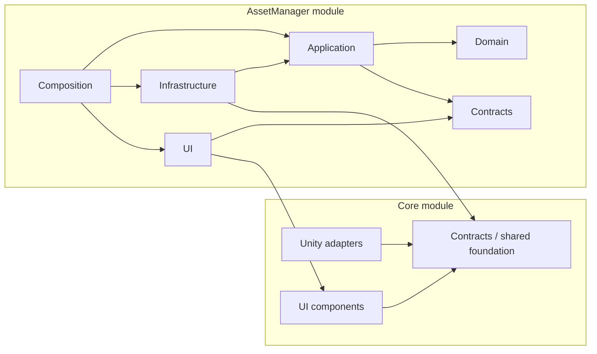

# Clean Architecture 移行メモ

この文書は移行作業中の設計メモであり、実装した内容は同じ変更単位で `docs~` の正式文書へ反映する。

ee4v は feature ごとの Module 境界を維持し、その内側を Clean Architecture の依存方向へ移行する。
ディレクトリを全体レイヤ別に並べ替えるのではなく、`Core`、`AssetManager`、今後追加する feature を
最上位の変更単位として扱う。

## 目的

- feature 固有の変更を、その Module 内で完結させる
- domain rule と use case を SQLite、filesystem、Unity Editor、UI Toolkit から独立させる
- Unity の更新や datasource の変更で、domain / application を変更しない
- static API を廃止し、test ごとに依存を差し替えられるようにする
- asmdef の参照関係で、禁止する依存をコンパイル時に検出する

## 非目標

- Module を横断した `Domain`、`Application`、`Infrastructure` ディレクトリへ再編しない
- DI container、Mediator、汎用 Repository 基底型、独自 event bus を導入しない
- DB schema や UI を、アーキテクチャ移行だけを理由に作り直さない
- すべてを rich domain model にしない。検索などの read path は read model を直接返してよい

## 互換性方針

この移行では旧実装との後方互換を要件にしない。適切な境界へ移行するために必要であれば、
breaking change を許容する。

- `AssetManagerApi` の公開 signature、namespace、型名、asmdef 名は維持しなくてよい
- static API、static event、旧 directory 構成は新しい依存方向へ置き換え、互換 facade は作らない
- DB schema、保存済み DB、cache、Module 固有 setting の互換性と migration は考慮しなくてよい
- DB と cache は削除・再生成、setting は既定値からの再作成を前提にできる
- 移行中だけ必要な adapter は `internal` に限定し、その slice の完了時に削除する

互換性を維持しないことは、現在 docs に定義されている機能要件を無条件に削除する意味ではない。
機能要件を変更する場合は、実装と同じ変更単位で該当 docs も更新する。

## アーキテクチャの二つの軸

Module 境界とレイヤ境界は別の関心として扱う。



- 横方向の最上位境界が Module である。`AssetManager` の domain 型を別 feature から直接使わない
- Module 内では外側から内側へだけ依存する
- `Core` は feature の寄せ集めではなく、複数 Module が実際に共有する契約と Unity adapter に限定する
- `Core` から feature Module への参照は禁止する

## Module 内のレイヤ

### Contracts

Module を利用する UI と他 Module に公開する安定した境界。

- request / response DTO
- public enum と error code
- `IAssetManager` のような Module facade interface
- change notification の契約

Contracts は Unity、Core、Domain、SQLite を参照しない。DTO は DB row や domain entity と兼用しない。
外部へ公開する必要がない契約は `internal` とし、必要な assembly にだけ `InternalsVisibleTo` を設定する。

### Domain

AssetManager の business rule を所有する。

- Item、File、Variant Group、Version Group、Collection、Dependency の identity と不変条件
- Collection の cycle 判定
- Dependency の自己参照・重複判定
- Import Target の path 正規化と traversal 拒否
- datasource snapshot と user override の reconciliation
- file grouping、source priority などの純粋な policy
- domain error code と、表示文言を含まない structured error

Domain は他の ee4v assembly、Unity、SQLite、filesystem、network、現在時刻、設定 API を参照しない。
必要な時刻、ID、設定値は引数または value object として受け取る。

### Application

一つのユーザー目的に対応する use case と、そのために必要な port を所有する。

- `SearchItems`
- `CreateItem`
- `SetFileImportTargets`
- `ImportFileTargets`
- `PrepareDatasourceSync`
- `ApplyDatasourceSync`
- `GetSyncInfo`

Application は transaction の境界、domain operation の順序、結果通知の条件を決める。
DB、Unity main thread、UI、localization の詳細は知らない。

port は「技術」ではなく use case が要求する能力として定義する。

```csharp
internal interface IAssetCatalogReadStore
{
    AssetSearchResult Search(AssetItemQuery query);
}

internal interface IAssetSyncStore
{
    AssetSyncStateSnapshot ReadState(AssetSourceType sourceType);
    void Apply(PreparedAssetSync preparedSync);
}

internal interface IAssetImportGateway
{
    void Import(AssetImportPlan plan);
}
```

`IRepository<T>` のような汎用 interface は作らない。SQLite の table 単位でもなく、use case が必要とする
atomic な操作単位で port を切る。

### Infrastructure

Application port の実装と外部システム adapter を置く。

- `Persistence/SQLite`: connection、schema、row、query、transaction、mapping
- `Datasources/Blm`: BLM database reader
- `Datasources/Eagle`: Eagle library / local API reader
- `Files`: filesystem、ZIP、persistent cache、thumbnail
- `Network`: HTTP thumbnail loader
- `Unity`: AssetDatabase、package import、EditorPrefs、SessionState などの adapter

SQLite exception はこのレイヤで storage error へ変換する。DB row を Contracts DTO として返さず、
Infrastructure 内で domain model または application read model へ mapping する。

Unity の private / internal API が必要な場合は、引き続き `Core/Internal/EditorAPI` の facade と
`Backends` を利用する。feature の Infrastructure から reflection を直接行わない。

### UI

現在の `Editor/AssetManager/UI` を維持し、Presentation adapter として扱う。

- View は state の描画と入力 event の通知だけを行う
- Presenter / Controller は `IAssetManager` を constructor または factory から受け取る
- UI state と domain entity / DB row を分ける
- `I18N` はこのレイヤでのみ表示文言へ変換する
- `EditorApplication.delayCall`、window lifecycle、UI Toolkit はこのレイヤまたは Composition に閉じる

UI から `AssetManagerDatabase`、SQLite、datasource connector を参照してはならない。新規コードは
static `AssetManagerApi` ではなく、注入された Contracts interface を使う。

### Composition

Module 唯一の composition root。

- settings / localization definition の登録
- use case と port implementation の生成
- UI factory への依存注入
- startup hook の登録と解除

依存の生成は明示的な constructor injection で行う。現在の規模では DI container を使わない。
`[InitializeOnLoad]` は `AssetManagerBootstrap` に集約し、個別 service の static constructor から
副作用を開始しない。

```csharp
[InitializeOnLoad]
internal static class AssetManagerBootstrap
{
    private static AssetManagerModule _module;

    static AssetManagerBootstrap()
    {
        EnsureInitialized();
    }

    internal static void EnsureInitialized()
    {
        if (_module != null)
        {
            return;
        }

        AssetManagerDefinitions.RegisterAll();
        _module = AssetManagerModuleFactory.CreateDefault();
        _module.Start();
    }
}
```

## 目標ディレクトリ

`AssetManager` という Module 境界と既存 `UI` の位置は維持する。

```text
Editor/
├─ Core/
│  ├─ Contracts/
│  ├─ Settings/
│  ├─ I18n/
│  ├─ Internal/EditorAPI/
│  └─ UI/
└─ AssetManager/
   ├─ Contracts/
   │  ├─ IAssetManager.cs
   │  ├─ Models/
   │  └─ Requests/
   ├─ Domain/
   │  ├─ Assets/
   │  ├─ Collections/
   │  ├─ Dependencies/
   │  ├─ Importing/
   │  └─ Sync/
   ├─ Application/
   │  ├─ Ports/
   │  ├─ Items/
   │  ├─ Files/
   │  ├─ Importing/
   │  └─ Sync/
   ├─ Infrastructure/
   │  ├─ Persistence/SQLite/
   │  ├─ Datasources/Blm/
   │  ├─ Datasources/Eagle/
   │  ├─ Files/
   │  ├─ Network/
   │  └─ Unity/
   ├─ UI/
   └─ Composition/
      ├─ AssetManagerBootstrap.cs
      ├─ AssetManagerModule.cs
      └─ AssetManagerDefinitions.cs
```

namespace は物理配置と一致させる。

- `Ee4v.AssetManager.Contracts`
- `Ee4v.AssetManager.Domain`
- `Ee4v.AssetManager.Application`
- `Ee4v.AssetManager.Infrastructure.*`
- `Ee4v.AssetManager.UI`
- `Ee4v.AssetManager.Composition`

localization scope の解決は現在 namespace に依存するため、`AssetManagerDefinitions` と localization
resource の scope が引き続き `AssetManager` になることを移動時の契約 test で保証する。

## asmdef の依存規則

最終的に以下の assembly で依存方向を固定する。

| assembly | 参照してよい ee4v assembly | `noEngineReferences` |
|---|---|---:|
| `Ee4v.AssetManager.Contracts.Editor` | なし | `true` |
| `Ee4v.AssetManager.Domain.Editor` | なし | `true` |
| `Ee4v.AssetManager.Application.Editor` | Contracts, Domain | `true` |
| `Ee4v.AssetManager.Infrastructure.Editor` | Contracts, Application, Core, SQLite | `false` |
| `Ee4v.AssetManager.UI.Editor` | Contracts, Core, UI | `false` |
| `Ee4v.AssetManager.Composition.Editor` | Contracts, Application, Infrastructure, UI, Core | `false` |

細分化が必要になるまでは Infrastructure を一つの asmdef に保つ。BLM / Eagle / SQLite を別 assembly
に分けるのは、個別配布、compile time、platform 条件のいずれかに具体的な効果が出てから行う。

`public` surface を増やさないため、Contracts 以外の assembly seam は原則 `internal` と
`InternalsVisibleTo` を使う。Architecture test は asmdef を読み、次を検出する。

- Domain / Application から Unity、Core、SQLite への参照
- UI から Application implementation、Infrastructure、SQLite への参照
- Module 間の Contracts 以外への参照
- Core から feature Module への参照
- `Domain` / `Application` 内の `Unity*`、`SQLite`、Core Settings、`I18N` の使用

## command と query

全面的な CQRS は導入しないが、read path と write path のモデルは分ける。

- query は最適化された read store から Contracts DTO / read model を返してよい
- command は Application が validation と transaction の境界を持つ
- domain invariant が必要な command は domain model / domain service を通す
- command 完了後の notification は Application が発行条件を決める
- DB trigger や UI が business notification の意味を決めない

これにより `SearchItems` のような大量 read で全 entity を構築する負担を避けながら、
Collection cycle や Dependency validation を DB helper の副作用から分離できる。

## notification

既存の static event は廃止し、instance 単位の通知へ移行する。

```csharp
public interface IAssetManagerNotifications
{
    event Action<AssetManagerChange> Changed;
}
```

`AssetManagerChange` は少なくとも以下を区別する。

- catalog structure / content changed
- file tree structure changed
- import targets changed
- version group primary file changed

UI は必要な粒度だけ再取得する。Module の Application service が notification を発行する。

## threading

- Domain と Application は Unity main thread を知らない
- Application の同期 API は呼び出し thread 上で動作し、必要な use case は `CancellationToken` を受ける
- background 実行と main thread への復帰は UI / Composition の scheduler adapter が担当する
- Unity API を使う port implementation は main-thread 制約を interface contract と test に明記する
- SQLite operation は connection を共有せず、use case / transaction ごとに所有する
- UI state と event 購読解除は Unity main thread に限定する

`Task.Run(...).ContinueWith(... EditorApplication.delayCall ...)` を controller や use case ごとに複製せず、
outer layer の scheduler に集約する。

## settings と localization

- `AssetManagerDefinitions` は Composition に置く
- Composition が `ISettingsService` をsettings adapterへ注入し、Applicationへtyped settings snapshotを渡す
- Domain は `SettingDefinition` を受け取らず、`SourcePriority` などの value object を受け取る
- Application / Domain は `I18N.Get(...)` を呼ばない
- UI は error code と context を localization key へ mapping する
- 公開 API の exception は安定した error code を保ち、表示時に UI が localization する

## Core の扱い

Core に Clean Architecture のレイヤ名を機械的に適用しない。Core は domain Module ではなく、
feature 横断の foundation と Unity adapter の集合である。

ただし、以下の依存方向は整理する。

- pure contract / state は Unity 非依存 assembly へ移せるようにする
- `Settings` の store、`Internal/EditorAPI`、Editor lifecycle は adapter として外側に置く
- `Core/UI` は Core contract だけに依存し、feature を参照しない
- feature 固有 port や model を Core へ置かない

### Core 移行状況

- [x] Settings contractを `Ee4v.Core.Contracts.Editor` へ分離し、Unity非依存化
- [x] `SettingsService` をinstance化し、store / serializerをport化
- [x] EditorPrefs、project file、Newtonsoftを `Ee4v.Core.Unity.Editor` へ分離
- [x] SettingsProvider、field、drawerを `Ee4v.UI.Editor` へ分離
- [x] feature Compositionから `ISettingsService` をadapterへ注入
- [x] I18Nのresolverを `LocalizationService` としてinstance化・Unity非依存化
- [x] catalog source、Settings language provider、diagnosticsを外側adapterへ分離
- [x] reloadとInjector/全View再描画をserviceとpresentationへ分離
- [x] Injectorのregistry、host lifecycle、Unity内部API accessを分離
- [x] Testingを独立Moduleへ分離
- [ ] Core移行完了時に、この `memo.md` と `memo.md.meta` を削除

## 現行コードからの対応

| 現在 | 移行先 | 分離する内容 |
|---|---|---|
| `api/AssetManagerModels.cs`、`Requests.cs`、`Enums.cs` | Contracts | public DTO と error contract |
| `api/AssetManagerApi.cs` | Contracts + Application | static facade を廃止し、instance facade と use case に分離 |
| `api/AssetManagerDatabase*.cs` | Infrastructure/Persistence/SQLite | connection、SQL、row、mapping |
| `AssetManagerDatabaseFileGrouping.cs` | Domain policy + Application + SQLite adapter | grouping rule と query / persistence を分離 |
| `AssetManagerDatabaseSync*.cs` | Domain/Sync + Application/Sync + Infrastructure | reconciliation、orchestration、SQL を分離 |
| `api/connecter/blm` | Infrastructure/Datasources/Blm | BLM reader。`connecter` typo も移行時に解消 |
| `api/connecter/eagle` | Infrastructure/Datasources/Eagle | Eagle reader / metadata parser |
| `AssetFileImportService.cs` | Application/Importing + Infrastructure/Unity, Files | import plan と Unity / filesystem 操作を分離 |
| `AssetFileTreeCache.cs` | Infrastructure/Files | persistent cache。window session cache は UI に残す |
| `AssetManagerDefinitions.cs` | Composition | setting 定義と登録 |
| `AssetManagerStartupSync.cs` | Application/Sync + Composition/Startup | sync use case と Editor lifecycle / scheduler を分離 |
| `UI/*Controller.cs` | UI presenter / controller | static API、Core Settings、EditorApplication を注入 port へ置換 |

## 移行戦略

各 slice の機能要件を確認しながら branch-by-abstraction で進める。旧 API や保存データとの互換層は
作らず、各段階は単独で compile、test、commit 可能にする。

### Phase 0: 境界 test

1. asmdef reference graph の architecture test を追加する
2. Domain / Application 予定領域の禁止 namespace audit を追加する
3. 主要 use case の振る舞いと DB integration test を移行前 baseline として固定する

### Phase 1: Contracts と composition root

1. models、requests、enums、exception を Contracts assembly へ移す
2. `IAssetManager` と notification contract を追加する
3. caller を `IAssetManager` の注入へ切り替える
4. static `AssetManagerApi` と static event を削除する
5. scattered な `[InitializeOnLoad]` を `AssetManagerBootstrap` から登録する方式へ寄せる

この段階では instance facade の実装先が既存 `AssetManagerDatabase` でもよい。まず caller と実装を
切り離し、外部互換のための二重 API は残さない。

### Phase 2: 最初の縦 slice

`SetFileImportTargets` を最初の slice とする。

- path normalization / validation が明確な domain rule
- DB transaction と notification がある
- UI は詳細 notification に既に対応している
- datasource sync 全体より影響範囲が小さい

Domain policy、Application use case、SQLite port implementation、instance facade、test を一巡させ、
以後の実装テンプレートにする。

### Phase 3: catalog command

次の順で command を移す。

1. Item create / update
2. Tag と Collection
3. Dependency
4. Variant / Version Group と file grouping
5. File register / archive

各 command で business validation を Domain へ、transaction と notification を Application へ、
SQL を Infrastructure へ移す。

### Phase 4: query

`GetItem`、`SearchItems`、thumbnail、file tree query を `IAssetCatalogReadStore` へ移す。
query は read model を維持し、無理に aggregate を復元しない。pagination と Smart Collection の SQL
一括化は、この段階で read store の内部改善として行える。

### Phase 5: import と datasource sync

1. import plan の生成を Application / Domain へ移す
2. filesystem / ZIP / Unity import を adapter 化する
3. BLM / Eagle reader を共通 snapshot contract の adapter にする
4. reconciliation を pure domain service にする
5. startup sync は同じ sync use case を呼ぶ Composition hook にする

### Phase 6: UI と legacy cleanup

1. Controller へ `IAssetManager`、settings、scheduler を注入する
2. UI から static API と direct settings access をなくす
3. SQLite、filesystem、Unity adapter を技術別 directory へ移す
4. 未使用になった legacy facade と helper を削除する

## test 方針

| test | 対象 | 外部依存 |
|---|---|---|
| Domain unit test | invariant、policy、reconciliation | なし |
| Application unit test | use case、transaction 順序、通知条件 | handwritten fake port |
| Infrastructure integration test | SQLite schema / query / transaction、datasource parser | temp DB / fixture |
| Contract test | Module contract の request / result、error code、notification | in-memory module fake |
| UI test | state 描画、入力 event、購読 lifecycle | fake `IAssetManager` |
| Architecture test | asmdef graph、namespace、禁止 API | source / JSON audit |

Application test から SQLite を開かず、Infrastructure test から Unity window を開かない。
既存の大きな `AssetManagerApiTests` は移行した slice ごとに上記 suite へ分割する。

## 完了条件

- Module の外から参照できるのは Contracts と明示した Core API だけ
- Domain / Application asmdef が `noEngineReferences: true` で compile できる
- Domain / Application に Unity、SQLite、filesystem、network、Core Settings、I18N 参照がない
- UI に DB row、SQLite、datasource connector 参照がない
- `[InitializeOnLoad]` による AssetManager の組み立てが一か所に集約されている
- static `AssetManagerApi` と static event の参照が残っていない
- command の transaction と notification 条件が Application test で検証されている
- Unity 内部 API の利用が Core facade / backend に限定され、fallback test と upgrade note が維持されている

## 移行結果

設計した Phase 0〜6 は完了した。正式な現行仕様は `docs~` を正本とし、この節は移行判断の履歴として
残す。

- Contracts、Domain、Application、Infrastructure、UI、Composition を Module 内の独立 asmdef として分離した
- `IAssetManager` の instance facade と typed change notification へ置き換え、旧 static API と `api` directory を削除した
- Import Target、catalog command validation、import plan、sync preparation/application orchestration を Domain / Application へ移した
- SQLite 実装を `Infrastructure/Persistence/SQLite`、filesystem / ZIP / cache を `Infrastructure/Files`、Unity import adapter を `Infrastructure/Unity` へ移した
- UI の `IAssetManager`、preferences、archive reader、background scheduler を Composition から注入するようにした
- 旧 namespace、asmdef、API、DB、cache、setting との互換 facade / migration は追加していない
- architecture test、Domain / Application unit test、Infrastructure integration test、UI test で境界と振る舞いを固定した
